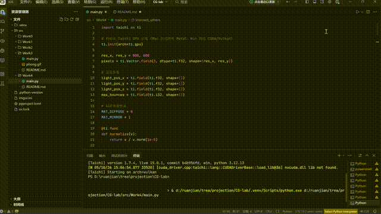

# 第五次作业

## 效果演示



## 项目架构

本项目采用模块化设计，主要包含以下文件：

- `src/Work4/main.py`：项目主入口，实现 Whitted-style 光线追踪

## 代码逻辑

1. **初始化**：
   - 使用 Taichi 库初始化 GPU 环境
   - 声明像素缓冲区和交互参数（光源位置、最大弹射次数）
   - 创建窗口和画布

2. **光线求交**：
   - 球体求交：使用二次方程求解
   - 平面求交：使用简单的射线-平面交点公式
   - 场景求交：遍历所有物体，返回最近交点

3. **材质系统**：
   - 漫反射材质：使用 Phong 光照模型计算颜色
   - 镜面反射材质：生成反射射线继续追踪

4. **Whitted-Style 光线追踪**：
   - 迭代式追踪光线（避免递归）
   - 支持多次镜面反射
   - 硬阴影检测

5. **渲染**：
   - 并行计算每个像素的颜色
   - 将渲染结果绘制到画布
   - 提供交互控制面板

## 实现功能

- **光线追踪**：实现球体和平面的光线求交测试
- **材质系统**：支持漫反射和镜面反射两种材质
- **硬阴影**：实现基于暗影射线的阴影检测
- **Phong 光照**：实现环境光和漫反射光照
- **多次反射**：支持可配置的光线弹射次数
- **棋盘格纹理**：地板使用棋盘格图案
- **实时交互**：通过 GUI 调整光源位置和弹射次数

## 技术特点

1. **GPU 加速**：利用 Taichi 的 GPU 后端实现并行计算
2. **Whitted-Style 光线追踪**：迭代式实现，支持多次反射
3. **材质系统**：区分漫反射和镜面反射材质
4. **阴影检测**：使用暗影射线实现硬阴影
5. **能量衰减**：镜面反射时能量逐渐衰减

## 运行方式

在项目根目录下运行：

```bash
python src/Work4/main.py
```

运行后会弹出一个窗口，显示光线追踪渲染的场景。右侧控制面板可以调整参数：
- **Light X/Y/Z**：光源位置
- **Max Bounces**：最大光线弹射次数（1-5次）

场景包含：
- 红色漫反射球（左侧）
- 银色镜面反射球（右侧）
- 棋盘格地板

银色球会反射红色球和地板的影像，展现出真实的镜面反射效果。
